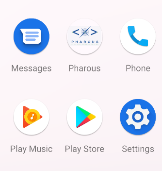
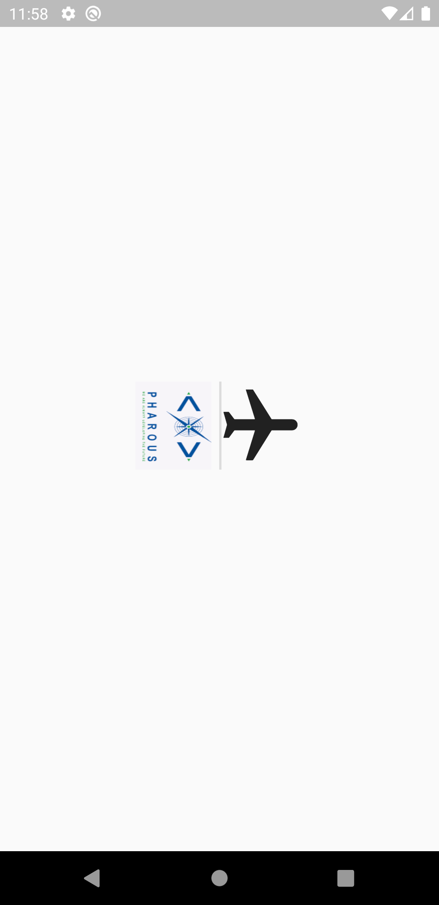
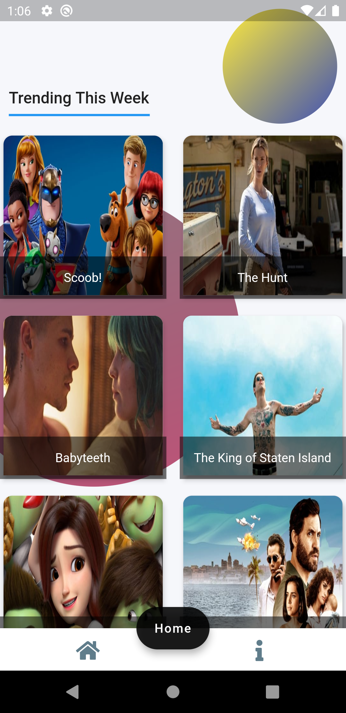
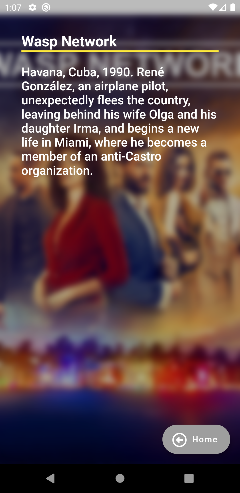

# flutterassignment

Flutter assignment for testing Bloc pattern
  <pre>
</pre>
you could test the apk from this link
https://drive.google.com/file/d/1vi78wdJgy41ykSJym6HG0gX0QVr6_7Ih/view?usp=sharing

  <pre>
AppIcon with Pharous logo
</pre>
  
  <pre>
Splash screen
</pre>
  
  <pre>
Home screen
</pre>
  
    <pre>
Details screen
</pre>
  
    <pre>
Webview screen for displaying Pharous website
</pre>
   

